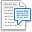
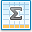
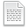

# Markdown Language Guide

Menu Map

* [Home](../README.md)
  * [Development Cycle](Dev_Cycle.md)
  * [Documentation Scopes](Documentation_Scopes.md)
    * [Dev Documentation](Document_Design.md)
    * [**Markdown Language Guide** :arrow\_backward: (Current Page)](Markdown_Language_Guide.md)
      * [Block Quotes](md_pages/Blockquotes_Tutorial.md)
      * [Colors](md_pages/Colors_Tutorial.md)
      * [Emojis](md_pages/Emojis_Tutorial.md)
      * [Emphasis](md_pages/Emphasis_Tutorial.md)
      * [Footnotes](md_pages/Footnotes_Tutorial.md)
      * [Headings](md_pages/Headings_Tutorial.md)
      * [Horizontal Rules](md_pages/Horizontal_Ruiles_Tutorial.md)
      * [Line Breaks](md_pages/Line_Breaks_Tutorial.md)
      * [Links](md_pages/Links_Tutorial.md)
      * [Lists](md_pages/Lists_Tutorial.md)
      * [Math](md_pages/Math_Tutorial.md)
      * [Paragraphs](md_pages/Paragraphs_Tutorial.md)
      * [Syntax Highlighted Code](md_pages/Syntax_Highlighed_Code_Tutorial.md)
      * [Tables](md_pages/Tables_Tutorial.md)
    * [Markdown Lint Guide](Markdown_Lint_Guide.md)
    * [Your README.md](Create_README.md)
  * [Software versioning](Software_Versioning.md)
  * [Source Control](Source_Control.md)
  * [Code Reviews](Code_Reviews.md)
  * [Coding Standards](Coding_Standards.md)
  * [Project references](Project_References.md)

## Overview

Nearly all Markdown applications support the basic syntax outlined in John Gruber’s original design document. There are minor variations and discrepancies between Markdown processors — those are noted inline wherever possible.

> **Note:** Using Markdown doesn't mean that you can't also use HTML. You can add HTML tags to any Markdown file. This is helpful if you prefer certain HTML tags to Markdown syntax. For example, some people find that it's easier to use HTML tags for images.

|    | **Item** | **Description** |
|:--:|:---------|:----------------|
|  | [Block Quotes](md_pages/Blockquotes_Tutorial.md) | A section of text that what quoted or used for notes. |
|  | [Colors](md_pages/Colors_Tutorial.md) | Add color chips within the scope of your document. |
|  | [Emojis](md_pages/Emojis_Tutorial.md) | Add icon based images within the scope of your document. |
|  | [Emphasis](md_pages/Emphasis_Tutorial.md) | Emphasize your text with formatting options. |
|  | [Footnotes](md_pages/Footnotes_Tutorial.md) | Show a labeled and reference note within text. |
|  | [Headings](md_pages/Headings_Tutorial.md) | A title or subtitle for separating text into sections. |
|  | [Horizontal Rules](md_pages/Horizontal_Ruiles_Tutorial.md) | An ability to separate sections for readability. |
|  | [Line Breaks](md_pages/Line_Breaks_Tutorial.md) | Enforce or maintain proper line breaks for each paragraph. |
|  | [Links](md_pages/Links_Tutorial.md) | Clickable text and image items to link to another location. |
|  | [Lists](md_pages/Lists_Tutorial.md) | Generate ordered, bulleted, or task lists. |
|  | [Math](md_pages/Math_Tutorial.md) | Show formulas of mathematical equations.  |
|  | [Paragraphs](md_pages/Paragraphs_Tutorial.md) | Text to describe your sectioned topic. |
|  | [Syntax Highlighted Code](md_pages/Syntax_Highlighed_Code_Tutorial.md) | The ability to highlight and colorize code for readability |
|  | [Tables](md_pages/Tables_Tutorial.md) | Create tables to organize and display in rows and columns |

## Fun Tools  
[Table Generator](http://www.tablesgenerator.com/markdown_tables)  
[Table Generator](http://www.tablesgenerator.com/markdown_tables) - Table Generator  
[Dillinger](https://dillinger.io/) - WYSIWYG Editor  
[Stack Edit](https://stackedit.io/app#) - Advanced WYSIWYG Editor  
[Editor.md](https://pandao.github.io/editor.md/en.html) - Another WYSIWYG Editor  
[Markdown Pad](http://markdownpad.com/) - Downloadable WYSIWYG Editor for Windows  
